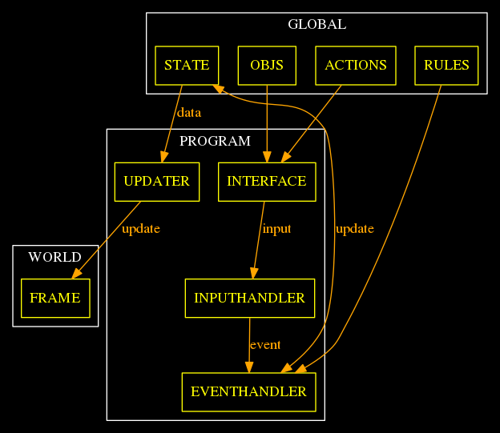

- [GRAPH](#orgbd0b2b2)
- [IMPLEMENTATION](#org4c44434)
  - [first GOAL make the player move (any direction)](#orgd5f96b1)
    - [variables](#org9dd8ef2)
    - [interface and handlers](#org4f0fc61)
    - [functions](#org6d8c818)
  - [MAIN FUNCTION](#org098f012)


<a id="orgbd0b2b2"></a>

# GRAPH




<a id="org4c44434"></a>

# IMPLEMENTATION


<a id="orgd5f96b1"></a>

## first GOAL make the player move (any direction)


<a id="org9dd8ef2"></a>

### variables

1.  state

    ```js
    /*
     list of objects  and his positions x y
     */
    
    let state = {
         "id": "humanInstance",
         "pos": {
           "x": 0,
           "y": 0
          }   
      };
    ```

2.  objects

    ```js
    const objects = [
     {
       "id": "human",
       "parts": {
    	       "head": true,
    	       "arms": true,
    	       "legs": true
       },
       "HP": 10
     }
    ]; 
    ```

3.  actions

    ```js
    const actions = ["walk"]
    ```

4.  rules

    ```js
    const rules = [
       {
        "action": "walk",
        "what":  objects[0].parts.legs, // todo: check the object instance
        "condition": true,
        "operator": "=",
        "sideEffect": "xPlusOne", 
       },
       {
        "action": "attack",
        "what":  [ objects[0].HP, 11],
        "condition": true,
        "operator": ">",
        "sideEffect": "attackEnemy" 
       },
    ];
    ```


<a id="org4f0fc61"></a>

### interface and handlers

```js
 /* 
       id , action => input { id: id , action: action}
  */
function INTERFACE(id, action ) {
   let input = Object.assign({"id":id}, {"action":action}, {});
   INPUTHANDLER(input); 
 }
```

```js
/*
  input  = event
*/

function INPUTHANDLER(input) {
  let event = input; 

//  console.log('inputhandler => event', event); 
  EVENTHANDLER(event); 
}
```

```js
function EVENTHANDLER(event) {

// event { id: 'human', action: 'walk' }

 let rule          =   rules.filter(el => el.action === event.action);
 let fnName        =   rule[0].sideEffect; 
 let what          =   rule[0].what; 
 let condition     =   rule[0].condition; 

 eval(`${fnName}(${what},${condition})`); 

}
```


<a id="org6d8c818"></a>

### functions

```js
let xPlusOne = (a,b) =>  {
 let  newState = Object
		       .assign(
			{},
			state,
			 {"pos": {"x": state.pos.x +1, "y": state.pos.y}} 
  ); 
state = newState;
console.log(state);
};
```

```js
let attackEnemy = () => { return 2;};
```


<a id="org098f012"></a>

## MAIN FUNCTION

```js
/*
 list of objects  and his positions x y
 */

let state = {
     "id": "humanInstance",
     "pos": {
       "x": 0,
       "y": 0
      }   
  };
const objects = [
 {
   "id": "human",
   "parts": {
	       "head": true,
	       "arms": true,
	       "legs": true
   },
   "HP": 10
 }
]; 
const actions = ["walk"]
const rules = [
   {
    "action": "walk",
    "what":  objects[0].parts.legs, // todo: check the object instance
    "condition": true,
    "operator": "=",
    "sideEffect": "xPlusOne", 
   },
   {
    "action": "attack",
    "what":  [ objects[0].HP, 11],
    "condition": true,
    "operator": ">",
    "sideEffect": "attackEnemy" 
   },
];
let xPlusOne = (a,b) =>  {
 let  newState = Object
		       .assign(
			{},
			state,
			 {"pos": {"x": state.pos.x +1, "y": state.pos.y}} 
  ); 
state = newState;
console.log(state);
};
let attackEnemy = () => { return 2;};
 /* 
       id , action => input { id: id , action: action}
  */
function INTERFACE(id, action ) {
   let input = Object.assign({"id":id}, {"action":action}, {});
   INPUTHANDLER(input); 
 }
/*
  input  = event
*/

function INPUTHANDLER(input) {
  let event = input; 

//  console.log('inputhandler => event', event); 
  EVENTHANDLER(event); 
}
function EVENTHANDLER(event) {

// event { id: 'human', action: 'walk' }

 let rule          =   rules.filter(el => el.action === event.action);
 let fnName        =   rule[0].sideEffect; 
 let what          =   rule[0].what; 
 let condition     =   rule[0].condition; 

 eval(`${fnName}(${what},${condition})`); 

}

INTERFACE("human" ,  "walk");
INTERFACE("human" ,  "walk");
```

Result:

    { id: 'humanInstance', pos: { x: 1, y: 0 } }
    { id: 'humanInstance', pos: { x: 2, y: 0 } }
    undefined