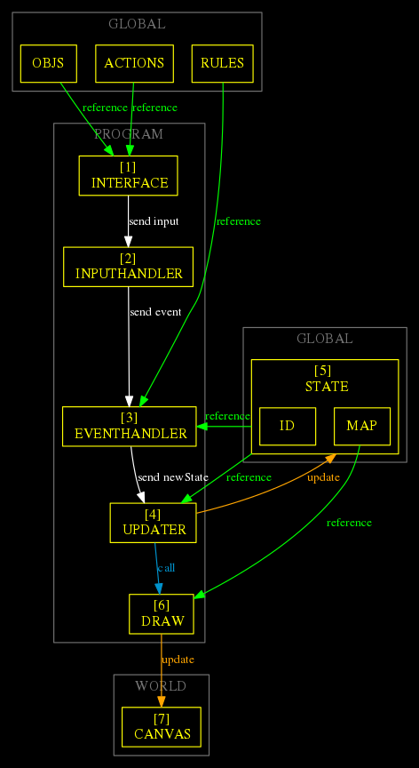

- [GRAPH](#org0b771cc)
- [GRAPH EXPLANATION](#org43beb26)
  - [GLOBAL:](#orgaddb7f8)
  - [PROGRAM](#org1e701d9)
  - [WORLD](#org05a142d)
  - [ORDER OF EXECUTION  [N]](#org8824ab0)
- [IMPLEMENTATION HTML](#org038b4c8)
- [IMPLEMENTATION JS](#orgb410db2)
  - [first GOAL make the player move (any direction)](#org2a98a49)
    - [canvas](#org597a741)
    - [variables](#org9576f0b)
    - [map](#org6b1a7b4)
    - [interface and handlers](#orgb210a80)
    - [functions](#org1518a24)
    - [MAIN FUNCTION](#org63e9618)


<a id="org0b771cc"></a>

# GRAPH




<a id="org43beb26"></a>

# GRAPH EXPLANATION


<a id="orgaddb7f8"></a>

## GLOBAL:

-   GLOBAL

From [MDN documentation:](https://developer.mozilla.org/en-US/docs/Glossary/Global_variable)

> A global variable is a variable that is declared in the global scope in other words, a variable that is visible from all other scopes.
> 
> In JavaScript it is a property of the global object.

From [Wikipedia:](https://en.wikipedia.org/wiki/Global_variable)

> In computer programming, a global variable is a variable with global scope, meaning that it is visible (hence accessible) throughout the program, unless shadowed. The set of all global variables is known as the global environment or global state. In compiled languages, global variables are generally static variables, whose extent (lifetime) is the entire runtime of the program, though in interpreted languages (including command-line interpreters), global variables are generally dynamically allocated when declared, since they are not known ahead of time.

-   OBJS

-   ACTIONS

-   RULES

> A rule is one or more condition applied to an event.

-   STATE
    
    From [Wikipedia:](https://en.wikipedia.org/wiki/State_(computer_science))

> In information technology and computer science, a program is described as stateful if it is designed to remember preceding events or user interactions;[1] the remembered information is called the state of the system.


<a id="org1e701d9"></a>

## PROGRAM

-   INTERFACE

-   INPUTHANDLER

-   EVENTHANDLER

-   UPDATER

-   DRAW


<a id="org05a142d"></a>

## WORLD

-   CANVAS


<a id="org8824ab0"></a>

## ORDER OF EXECUTION  [N]

-   [1] INTERFACE

-   [2] INPUTHANDLER

-   [3] EVENTHANDLER

-   [4] UPDATER

-   [5] GLOBAL STATE

-   [6] DRAW

-   [7] CANVAS


<a id="org038b4c8"></a>

# IMPLEMENTATION HTML

```html
<!doctype html>
<html lang="en">
    <head>
	<meta charset="UTF-8"/>
	<title>Roguelike</title>
    </head>
    <style>
     .container {
	margin: 0 auto;
	width:  150px;
	height: 150px;
      }
     .canvas {
      margin: 0 auto;
      border: 1px solid black;
     } 
    </style>
    <body>
     <div class="container">
     <canvas id="canvas" class="canvas" width="150" height="150"></canvas>
     </div>
    </body>
    <script src="index.js"></script>
</html>
```


<a id="orgb410db2"></a>

# IMPLEMENTATION JS


<a id="org2a98a49"></a>

## first GOAL make the player move (any direction)


<a id="org597a741"></a>

### canvas

```js
const canvas = document.getElementById("canvas");
const ctx = canvas.getContext("2d");
```


<a id="org9576f0b"></a>

### variables


<a id="org6b1a7b4"></a>

### map

|     | x0 | x1 | x2 | x3 | x4 | x5 | x6 | x7 | x8 | x9 | x10 | x11 | x12 | x13 | x14 |
|--- |--- |--- |--- |--- |--- |--- |--- |--- |--- |--- |--- |--- |--- |--- |--- |
| y0  | 1  | 1  | 1  | 1  | 1  | 1  | 1  | 1  | 1  | 1  | 1   | 1   | 1   | 1   | 1   |
| y1  | 1  | 0  | 0  | 0  | 0  | 0  | 0  | 0  | 0  | 0  | 0   | 0   | 0   | 0   | 1   |
| y2  | 1  | 0  | 0  | 0  | 0  | 0  | 0  | 0  | 0  | 0  | 0   | 0   | 0   | 0   | 1   |
| y3  | 1  | 0  | 0  | 0  | 1  | 1  | 1  | 1  | 1  | 1  | 0   | 0   | 0   | 0   | 1   |
| y4  | 1  | 0  | 0  | 0  | 1  | 1  | 1  | 1  | 1  | 1  | 0   | 0   | 0   | 0   | 1   |
| y5  | 1  | 0  | 0  | 0  | 0  | 0  | 0  | 1  | 0  | 0  | 0   | 0   | 0   | 0   | 1   |
| y6  | 1  | 0  | 0  | 0  | 0  | 0  | 0  | 0  | 0  | 0  | 0   | 0   | 0   | 0   | 1   |
| y7  | 1  | 0  | 0  | 0  | 0  | 0  | 0  | 0  | 0  | 0  | 0   | 0   | 0   | 0   | 1   |
| y8  | 1  | 0  | 0  | 0  | 0  | 0  | 0  | 0  | 0  | 1  | 1   | 1   | 0   | 0   | 1   |
| y9  | 1  | 0  | 0  | 0  | 0  | 0  | 0  | 0  | 0  | 1  | 1   | 1   | 0   | 0   | 1   |
| y10 | 1  | 0  | 0  | 0  | 0  | 0  | 0  | 0  | 0  | 0  | 1   | 1   | 0   | 0   | 1   |
| y11 | 1  | 0  | 0  | 0  | 0  | 0  | 0  | 0  | 0  | 0  | 0   | 0   | 0   | 0   | 1   |
| y12 | 1  | 0  | 0  | 0  | 0  | 0  | 0  | 0  | 0  | 0  | 0   | 0   | 0   | 0   | 1   |
| y13 | 1  | 0  | 0  | 0  | 0  | 0  | 0  | 0  | 0  | 0  | 0   | 0   | 0   | 0   | 1   |
| y14 | 1  | 1  | 1  | 1  | 1  | 1  | 1  | 1  | 1  | 1  | 1   | 1   | 1   | 1   | 1   |

| map[y][x]  | 0 | 1 | 2 | 3 | 4 | 5 | 6 | 7 | 8 | 9 | 10 | 11 | 12 | 13 | 14 |
|---------- |--- |--- |--- |--- |--- |--- |--- |--- |--- |--- |--- |--- |--- |--- |--- |
| map[0][x]  | 1 | 1 | 1 | 1 | 1 | 1 | 1 | 1 | 1 | 1 | 1  | 1  | 1  | 1  | 1  |
| map[1][x]  | 1 | 0 | 0 | 0 | 0 | 0 | 0 | 0 | 0 | 0 | 0  | 0  | 0  | 0  | 1  |
| map[2][x]  | 1 | 0 | 0 | 0 | 0 | 0 | 0 | 0 | 0 | 0 | 0  | 0  | 0  | 0  | 1  |
| map[3][x]  | 1 | 0 | 0 | 0 | 1 | 1 | 1 | 1 | 1 | 1 | 0  | 0  | 0  | 0  | 1  |
| map[4][x]  | 1 | 0 | 0 | 0 | 1 | 1 | 1 | 1 | 1 | 1 | 0  | 0  | 0  | 0  | 1  |
| map[5][x]  | 1 | 0 | 0 | 0 | 0 | 0 | 0 | 1 | 0 | 0 | 0  | 0  | 0  | 0  | 1  |
| map[6][x]  | 1 | 0 | 0 | 0 | 0 | 0 | 0 | 0 | 0 | 0 | 0  | 0  | 0  | 0  | 1  |
| map[7][x]  | 1 | 0 | 0 | 0 | 0 | 0 | 0 | 0 | 0 | 0 | 0  | 0  | 0  | 0  | 1  |
| map[8][x]  | 1 | 0 | 0 | 0 | 0 | 0 | 0 | 0 | 0 | 1 | 1  | 1  | 0  | 0  | 1  |
| map[9][x]  | 1 | 0 | 0 | 0 | 0 | 0 | 0 | 0 | 0 | 1 | 1  | 1  | 0  | 0  | 1  |
| map[10][x] | 1 | 0 | 0 | 0 | 0 | 0 | 0 | 0 | 0 | 0 | 1  | 1  | 0  | 0  | 1  |
| map[11][x] | 1 | 0 | 0 | 0 | 0 | 0 | 0 | 0 | 0 | 0 | 0  | 0  | 0  | 0  | 1  |
| map[12][x] | 1 | 0 | 0 | 0 | 0 | 0 | 0 | 0 | 0 | 0 | 0  | 0  | 0  | 0  | 1  |
| map[13][x] | 1 | 0 | 0 | 0 | 0 | 0 | 0 | 0 | 0 | 0 | 0  | 0  | 0  | 0  | 1  |
| map[14][x] | 1 | 1 | 1 | 1 | 1 | 1 | 1 | 1 | 1 | 1 | 1  | 1  | 1  | 1  | 1  |

```js
var map = [
  [1,1,1,1,1,1,1,1,1,1,1,1,1,1,1],
  [1,0,0,0,0,0,0,0,0,0,0,0,0,0,1],
  [1,0,0,0,0,0,0,0,0,0,0,0,0,0,1],
  [1,0,0,0,1,1,1,1,1,1,0,0,0,0,1],
  [1,0,0,0,1,1,1,1,1,1,0,0,0,0,1],
  [1,0,0,0,0,0,0,1,0,0,0,0,0,0,1],
  [1,0,0,0,0,0,0,0,0,0,0,0,0,0,1],
  [1,0,0,0,0,0,0,0,0,0,0,0,0,0,1],
  [1,0,0,0,0,0,0,0,0,1,1,1,0,0,1],
  [1,0,0,0,0,0,0,0,0,1,1,1,0,0,1],
  [1,0,0,0,0,0,0,0,0,0,1,1,0,0,1],
  [1,0,0,0,0,0,0,0,0,0,0,0,0,0,1],
  [1,0,0,0,0,0,0,0,0,0,0,0,0,0,1],
  [1,0,0,0,0,0,0,0,0,0,0,0,0,0,1],
  [1,1,1,1,1,1,1,1,1,1,1,1,1,1,1]

];
```

1.  state

    -   pos:
        -   x:
        -   y:
    
    ```js
    /*
     list of objects  and his positions x y
     */
    
    let state = {
         "id": "humanInstance",
         "pos": {
           "x": 6,
           "y": 5
          },
          "width": 10,
          "height": 10
      };
    ```

2.  objects

    ```js
    const objects = [
     {
       "id": "human",
       "parts": {
    	       "head": true,
    	       "arms": true,
    	       "legs": true
       },
       "HP": 10
     }
    ]; 
    ```

3.  actions

    ```js
    const actions = ["walk"];
    
    ```

4.  rules

    ```js
    const rules = [
       {
        "action": "walk",
        "what":  objects[0].parts.legs, // todo: check the object instance
        "condition": true,
        "operator": "=",
        "sideEffect": "xPlusOne", 
       },
       {
        "action": "attack",
        "what":  [ objects[0].HP, 11],
        "condition": true,
        "operator": ">",
        "sideEffect": "attackEnemy" 
       },
    ];
    ```


<a id="orgb210a80"></a>

### interface and handlers

1.  INTERFACE

    ```js
     /* 
           id , action => input { id: id , action: action}
      */
    function INTERFACE(id, action ) {
       let input = Object.assign({"id":id}, {"action":action}, {});
       INPUTHANDLER(input); 
     }
    ```

2.  INPUTHANDLER

    ```js
      /*
        input  = event
      */
    
      function INPUTHANDLER(input) {
        let event = input; 
    //  console.log('inputhandler => event', event); 
        EVENTHANDLER(event); 
      }
    ```

3.  EVENTHANDLER

    -   select:
        -   rule
        -   fn
        -   what
        -   condition
    
    -   collision detection
    
    -   send newState to UPDATER
    
    ```js
    function EVENTHANDLER(event) {
      // event { id: 'human', action: 'walk' }
    
      let rule = rules.filter(el => el.action === event.action);
      let fnName = rule[0].sideEffect;
      let what = rule[0].what;
      let condition = rule[0].condition;
    
      // collision detection
      if (map[state.pos.x + 1][state.pos.y] === 0) {
        let newState = eval(`${fnName}(${what},${condition})`); // return newState
        UPDATER(newState); // update frame
      } else {
        console.log("collision detected");
      }
    
      console.log(state);
    }
    ```

4.  UPDATER

    -   Update:
        -   state
    
    -   Call:
        -   draw
    
    ```js
    
    function UPDATER(newState) {
     let prevState = state;
    
      map[prevState.pos.y][prevState.pos.x] = 0; // update map
      map[newState.pos.y][newState.pos.x] = 1;  // update map
    
      state = newState;
    
      draw();
    
    };
    
    
    ```


<a id="org1518a24"></a>

### functions

```js
let xPlusOne = (a,b) =>  {
 let  newState = Object
		     .assign(
		      {},
		      state,
		       {"pos": {"x": state.pos.x +1, "y": state.pos.y}} 
  ); 

return newState;
};
```

```js
let attackEnemy = () => { return 2;};
```


<a id="org63e9618"></a>

### MAIN FUNCTION

```js
const canvas = document.getElementById("canvas");
const ctx = canvas.getContext("2d");
/*
 list of objects  and his positions x y
 */

let state = {
     "id": "humanInstance",
     "pos": {
       "x": 6,
       "y": 5
      },
      "width": 10,
      "height": 10
  };
const objects = [
 {
   "id": "human",
   "parts": {
	       "head": true,
	       "arms": true,
	       "legs": true
   },
   "HP": 10
 }
]; 
const actions = ["walk"];

const rules = [
   {
    "action": "walk",
    "what":  objects[0].parts.legs, // todo: check the object instance
    "condition": true,
    "operator": "=",
    "sideEffect": "xPlusOne", 
   },
   {
    "action": "attack",
    "what":  [ objects[0].HP, 11],
    "condition": true,
    "operator": ">",
    "sideEffect": "attackEnemy" 
   },
];
let xPlusOne = (a,b) =>  {
 let  newState = Object
		     .assign(
		      {},
		      state,
		       {"pos": {"x": state.pos.x +1, "y": state.pos.y}} 
  ); 

return newState;
};
let attackEnemy = () => { return 2;};
 /* 
       id , action => input { id: id , action: action}
  */
function INTERFACE(id, action ) {
   let input = Object.assign({"id":id}, {"action":action}, {});
   INPUTHANDLER(input); 
 }
  /*
    input  = event
  */

  function INPUTHANDLER(input) {
    let event = input; 
//  console.log('inputhandler => event', event); 
    EVENTHANDLER(event); 
  }
function EVENTHANDLER(event) {
  // event { id: 'human', action: 'walk' }

  let rule = rules.filter(el => el.action === event.action);
  let fnName = rule[0].sideEffect;
  let what = rule[0].what;
  let condition = rule[0].condition;

  // collision detection
  if (map[state.pos.x + 1][state.pos.y] === 0) {
    let newState = eval(`${fnName}(${what},${condition})`); // return newState
    UPDATER(newState); // update frame
  } else {
    console.log("collision detected");
  }

  console.log(state);
}

function UPDATER(newState) {
 let prevState = state;

  map[prevState.pos.y][prevState.pos.x] = 0; // update map
  map[newState.pos.y][newState.pos.x] = 1;  // update map

  state = newState;

  draw();

};


let w = 150;
let h = 150;
let tileSize = 10;


/*
  0 : walkable
  1 : not walkable (a wall)
 */ 
// canvas 150x150 , tileSize 10
var map = [
  [1,1,1,1,1,1,1,1,1,1,1,1,1,1,1],
  [1,0,0,0,0,0,0,0,0,0,0,0,0,0,1],
  [1,0,0,0,0,0,0,0,0,0,0,0,0,0,1],
  [1,0,0,0,1,1,1,1,1,1,0,0,0,0,1],
  [1,0,0,0,1,1,1,1,1,1,0,0,0,0,1],
  [1,0,0,0,0,0,0,1,0,0,0,0,0,0,1],
  [1,0,0,0,0,0,0,0,0,0,0,0,0,0,1],
  [1,0,0,0,0,0,0,0,0,0,0,0,0,0,1],
  [1,0,0,0,0,0,0,0,0,1,1,1,0,0,1],
  [1,0,0,0,0,0,0,0,0,1,1,1,0,0,1],
  [1,1,1,1,1,1,1,1,0,0,1,1,0,0,1],
  [1,0,0,0,1,0,0,0,0,0,0,0,0,0,1],
  [1,0,0,0,1,0,0,0,0,0,0,0,0,0,1],
  [1,0,0,0,1,0,0,0,0,0,0,0,0,0,1],
  [1,1,1,1,1,1,1,1,1,1,1,1,1,1,1]

];


function draw (){
  ctx.clearRect(0, 0, w, h);
  ctx.fillStyle = "rgba(255,0,0,0.6)";

  map.forEach(function(row,i){
    row.forEach(function(tile,j){
      if(tile !== 0){ //if tile is not walkable
       drawTile(j,i); //draw a rectangle at j,i
      }
    });
  });

}


function drawTile (x,y){
  ctx.fillRect(
    x * tileSize, y * tileSize,
    tileSize, tileSize
  );
}

draw();

//INTERFACE("human" ,  "walk");
```