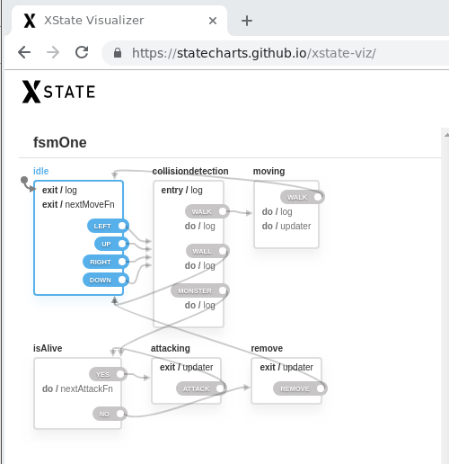

- [Diagram](#org9ff0967)
- [Diagram Explanation](#orgc0aa1c7)
- [Setup](#org9408b37)
  - [Dependencies](#org9aba5ff)
- [Demo](#org046dbf3)

# Diagram

# Diagram Explanation

# Setup

## Dependencies

-   Xstate

-   jsdom

-   sinon

-   tape

# Demo

[Live link](https://diegoperezm.github.io/roguelike/src/index.html)
