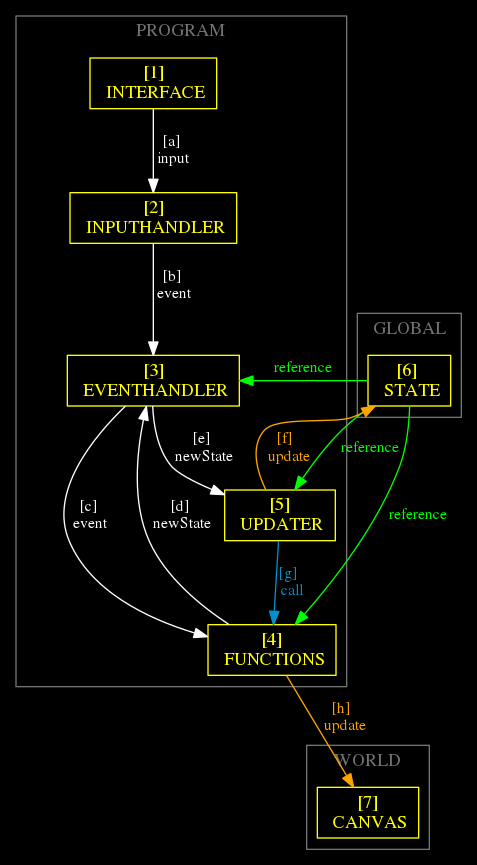
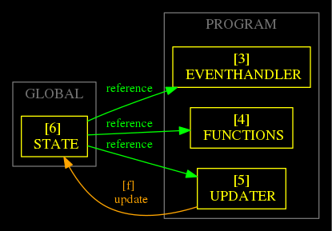
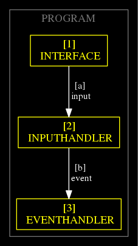
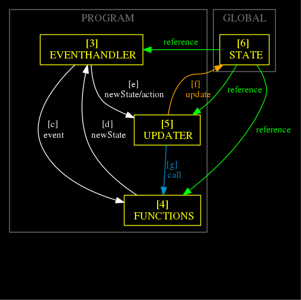
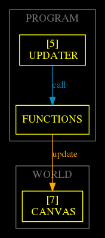

- [Diagram](#org756d2b4)
- [Diagram Explanation](#orgff229f8)
  - [GLOBAL](#org4c319ec)
  - [PROGRAM](#orga501cf9)
  - [WORLD](#org8b01bdf)
  - [ORDER](#orgbebaf7d)
- [Setup](#org306bff8)
  - [Dependencies](#orgad53ca8)
- [HTML](#org5676c17)
- [JavaScript](#orgd12b390)
    - [canvas](#org2c9632f)
    - [variables](#org6464e40)
    - [INTERFACE and HANDLERS](#orgeb2ab6e)
    - [UPDATER](#orgc0ae686)
    - [functions](#orga720cb9)
    - [MAIN FUNCTION](#org82f9a2c)


<a id="org756d2b4"></a>

# Diagram




<a id="orgff229f8"></a>

# Diagram Explanation


<a id="org4c319ec"></a>

## GLOBAL

-   GLOBAL

From [MDN documentation:](https://developer.mozilla.org/en-US/docs/Glossary/Global_variable)

> A global variable is a variable that is declared in the global scope in other words, a variable that is visible from all other scopes.
> 
> In JavaScript it is a property of the global object.

From [Wikipedia:](https://en.wikipedia.org/wiki/Global_variable)

> In computer programming, a global variable is a variable with global scope, meaning that it is visible (hence accessible) throughout the program, unless shadowed. The set of all global variables is known as the global environment or global state. In compiled languages, global variables are generally static variables, whose extent (lifetime) is the entire runtime of the program, though in interpreted languages (including command-line interpreters), global variables are generally dynamically allocated when declared, since they are not known ahead of time.

-   STATE
    
    From [Wikipedia:](https://en.wikipedia.org/wiki/State_(computer_science))

> In information technology and computer science, a program is described as stateful if it is designed to remember preceding events or user interactions;[1] the remembered information is called the state of the system.


<a id="orga501cf9"></a>

## PROGRAM

-   INTERFACE
    -   The entry point of player data
    
    -   Called by an event listener
    
    -   Ouput:
        -   Object

-   INPUTHANDLER
    -   Transform the input into a custom event
    
    -   Input:
        -   Object
    
    -   Ouput:
        -   Object

-   EVENTHANDLER
    -   Apply the rules for:
        -   move
        
        -   attack
        
        -   collision detection
    
    -   Send a new state to UPDATER
    
    -   Input:
        -   Object
    
    -   Ouput:
        -   Object || Array of Objects

-   UPDATER
    -   Update:
        -   STATE
        
        -   CANVAS

-   DRAW
    -   Helper function:
        -   Draw canvas


<a id="org8b01bdf"></a>

## WORLD

-   [CANVAS](https://developer.mozilla.org/en-US/docs/Web/HTML/Element/canvas)

> Use the HTML <canvas> element with either the canvas scripting API or the WebGL API to draw graphics and animations.

-   [CANVAS API](https://developer.mozilla.org/en-US/docs/Web/API/Canvas_API)

> The Canvas API provides a means for drawing graphics via JavaScript and the HTML <canvas> element. Among other things, it can be used for animation, game graphics, data visualization, photo manipulation, and real-time video processing.


<a id="orgbebaf7d"></a>

## ORDER

-   [1] INTERFACE
    -   Called by an event listener

-   [2] INPUTHANDLER
    -   Called by INTERFACE

-   [3] EVENTHANDLER
    -   Called by INPUTHANDLER

-   [4] FUNCTIONS
    -   Called by:
        -   EVENTHANDLER to get a new state
        -   UPDATER to update:
            -   state
            
            -   canvas
            
            -   DOM

-   [5] UPDATER
    -   Called by EVENTHANDLER passing a new state

-   [6] GLOBAL STATE
    -   Updated by UPDATER

-   [7] CANVAS


<a id="org306bff8"></a>

# Setup


<a id="orgad53ca8"></a>

## Dependencies

-   jsdom

-   sinon

-   tape


<a id="org5676c17"></a>

# HTML

```html
<!doctype html>
<html lang="en">
    <head>
	<meta charset="UTF-8"/>
	<meta name="viewport" content="width=device-width, initial-scale=1">
	<title>Roguelike</title>
    </head>
    <style>
     body {
      overflow: hidden;
     }
      *, *:after, *:before {
	  -webkit-box-sizing: border-box;
	  -moz-box-sizing: border-box;
	 box-sizing: border-box;
      }
     .container {
	 max-width: 1024px;
	 margin: 0 auto;
	 display: grid;
	 grid-template-columns: repeat(12, [col-start] 1fr);
	 row-gap: 10px;
	 column-gap: 50px;
      }

     .canvas {
	 grid-column: col-start 3/span 4;
     } 
     .playerInfo {
	 grid-column: col-start 8/span 4;
	 max-width: 100%; 
	 border: 10px solid black;
     }
     .worldInfo {
	 grid-column: col-start 3/span 9;
	 grid-row: 3/6;
	 max-width: 100%; 
	 max-height: 100%; 
	 min-height: 300px; 
	 border: 10px solid black;

    } 

    </style>
    <body>
     <div class="container">
     <canvas id="canvas" class="canvas" width="400" height="400"></canvas>
     <div class="playerInfo" id="playerInfo">
      <ul>
       <li id="playerId"></li>
       <li id="playerPosX"></li>
       <li id="playerPosY"></li>
       <li id="playerHP"></li>
      </ul>
     </div>
     <div class="worldInfo"  id="worldInfo">
       <div class="monsterInfo" id="monsterInfo">
	<ul id="monsterInfoList">
	 <li id="monsterId"></li>
	 <li id="monsterPosX"></li>
	 <li id="monsterPosY"></li>
	 <li id="monsterHP"></li>
	</ul>
       </div> 
     </div>
    </body>
    <script src="index.js"></script>
</html>
```


<a id="orgd12b390"></a>

# JavaScript


<a id="org2c9632f"></a>

### canvas

```js
const canvas = document.getElementById("canvas");
const ctx = canvas.getContext("2d");
```


<a id="org6464e40"></a>

### variables

1.  map

    
    
    -   Examples:
    
    
    
    |     | x0 | x1 | x2 | x3 | x4 | x5 | x6 | x7 | x8 | x9 | x10 |
    |--- |--- |--- |--- |--- |--- |--- |--- |--- |--- |--- |--- |
    | y0  | 1  | 1  | 1  | 1  | 1  | 1  | 1  | 1  | 1  | 1  | 1   |
    | y1  | 1  | 0  | 0  | 0  | 0  | 0  | 0  | 0  | 0  | 0  | 0   |
    | y2  | 1  | 0  | 0  | 0  | 0  | 0  | 0  | 0  | 0  | 0  | 0   |
    | y3  | 1  | 0  | 0  | 0  | 1  | 1  | 1  | 1  | 1  | 1  | 0   |
    | y4  | 1  | 0  | 0  | 0  | 1  | 1  | 1  | 1  | 1  | 1  | 0   |
    | y5  | 1  | 0  | 0  | 0  | 0  | 0  | 0  | 1  | 0  | 0  | 0   |
    | y6  | 1  | 0  | 0  | 0  | 0  | 0  | 0  | 0  | 0  | 0  | 0   |
    | y7  | 1  | 0  | 0  | 0  | 0  | 0  | 0  | 0  | 0  | 0  | 0   |
    | y8  | 1  | 0  | 0  | 0  | 0  | 0  | 0  | 0  | 0  | 1  | 1   |
    | y9  | 1  | 0  | 0  | 0  | 0  | 0  | 0  | 0  | 0  | 1  | 1   |
    | y10 | 1  | 0  | 0  | 0  | 0  | 0  | 0  | 0  | 0  | 0  | 1   |
    
    
    
    | map[y][x]  | 0 | 1 | 2 | 3 | 4 | 5 | 6 | 7 | 8 | 9 | 10 |
    |---------- |--- |--- |--- |--- |--- |--- |--- |--- |--- |--- |--- |
    | map[0][x]  | 1 | 1 | 1 | 1 | 1 | 1 | 1 | 1 | 1 | 1 | 1  |
    | map[1][x]  | 1 | 0 | 0 | 0 | 0 | 0 | 0 | 0 | 0 | 0 | 0  |
    | map[2][x]  | 1 | 0 | 0 | 0 | 0 | 0 | 0 | 0 | 0 | 0 | 0  |
    | map[3][x]  | 1 | 0 | 0 | 0 | 1 | 1 | 1 | 1 | 1 | 1 | 0  |
    | map[4][x]  | 1 | 0 | 0 | 0 | 1 | 1 | 1 | 1 | 1 | 1 | 0  |
    | map[5][x]  | 1 | 0 | 0 | 0 | 0 | 0 | 0 | 1 | 0 | 0 | 0  |
    | map[6][x]  | 1 | 0 | 0 | 0 | 0 | 0 | 0 | 0 | 0 | 0 | 0  |
    | map[7][x]  | 1 | 0 | 0 | 0 | 0 | 0 | 0 | 0 | 0 | 0 | 0  |
    | map[8][x]  | 1 | 0 | 0 | 0 | 0 | 0 | 0 | 0 | 0 | 1 | 1  |
    | map[9][x]  | 1 | 0 | 0 | 0 | 0 | 0 | 0 | 0 | 0 | 1 | 1  |
    | map[10][x] | 1 | 0 | 0 | 0 | 0 | 0 | 0 | 0 | 0 | 0 | 1  |
    
    
    
    -   Code:
    
    
    
    ```js
    /*
      0 : walkable
      1 : not walkable (a wall)
     */ 
    
    // prettier-ignore
    var map = [
    [1,1,1,1,1,1,1,1,1,1,1,1,1,1,1,1,1,1,1,1,1,1,1,1,1,1,1,1,1,1,1],
    [1,0,0,0,0,0,0,0,0,0,0,0,0,0,0,0,0,0,0,0,0,0,0,0,0,0,0,0,0,0,1],
    [1,0,0,0,0,0,0,0,0,0,0,0,0,0,0,0,0,0,0,0,0,0,0,0,0,0,0,0,0,0,1],
    [1,0,0,0,0,0,0,0,0,0,0,0,0,0,0,0,0,0,0,0,0,0,0,0,0,0,0,0,0,0,1],
    [1,0,0,0,0,0,0,0,0,0,0,0,0,0,0,0,0,0,0,0,0,0,0,0,0,0,0,0,0,0,1],
    [1,0,0,0,0,0,0,0,0,0,0,0,0,0,0,0,0,0,0,0,0,0,0,0,0,0,0,0,0,0,1],
    [1,0,0,0,0,0,0,0,0,0,0,0,1,1,1,1,1,1,1,1,1,0,0,0,0,0,0,0,0,0,1],
    [1,0,0,0,0,0,0,0,0,0,0,0,1,1,1,1,1,1,1,1,1,0,0,0,0,0,0,0,0,0,1],
    [1,0,0,0,0,0,0,0,0,0,0,0,1,1,1,1,1,1,1,1,1,0,0,0,0,0,0,0,0,0,1],
    [1,0,0,0,0,0,0,0,0,0,0,0,0,0,0,0,0,0,0,0,0,0,0,0,0,0,0,0,0,0,1],
    [1,0,0,0,0,0,0,0,0,0,0,0,0,0,0,0,0,0,0,0,0,0,0,0,0,0,0,0,0,0,1],
    [1,0,0,0,0,0,0,0,0,0,0,0,0,0,0,0,0,0,0,0,0,0,0,0,0,0,0,0,0,0,1],
    [1,0,0,0,0,0,0,0,0,0,0,0,0,0,0,0,0,0,0,0,0,0,0,0,0,0,0,0,0,0,1],
    [1,0,0,0,0,0,0,0,0,0,0,0,0,0,0,0,0,0,0,0,0,0,0,0,0,0,0,0,0,0,1],
    [1,0,0,0,0,0,0,0,0,0,0,0,0,0,0,0,0,0,0,0,0,0,0,0,0,0,0,0,0,0,1],
    [1,0,0,0,0,0,0,0,0,0,0,0,0,0,0,0,0,0,0,0,0,0,0,0,0,0,0,0,0,0,1],
    [1,0,0,0,0,0,0,0,0,0,0,0,0,0,0,0,0,0,0,0,0,0,0,0,0,0,0,0,0,0,1],
    [1,0,0,0,0,0,0,0,0,0,0,0,0,0,0,0,0,0,0,0,0,0,0,0,0,0,0,0,0,0,1],
    [1,0,0,0,0,0,0,0,0,0,0,0,0,0,0,0,0,0,0,0,0,0,0,0,0,0,0,0,0,0,1],
    [1,0,0,0,0,0,0,0,0,0,0,0,0,0,0,0,0,0,0,0,0,0,0,0,0,0,0,0,0,0,1],
    [1,0,0,0,0,0,0,0,0,0,0,0,0,0,0,0,0,0,0,0,0,0,0,0,0,0,0,0,0,0,1],
    [1,0,0,0,0,0,0,0,0,0,0,0,0,0,0,0,0,0,0,0,0,0,0,0,0,0,0,0,0,0,1],
    [1,0,0,0,0,0,0,0,0,0,0,0,0,0,0,0,0,0,0,0,0,0,0,0,0,0,0,0,0,0,1],
    [1,0,0,0,0,0,0,0,0,0,0,0,0,0,0,0,0,0,0,0,0,0,0,0,0,0,0,0,0,0,1],
    [1,0,0,0,0,0,0,0,0,0,0,0,0,0,0,0,0,0,0,0,0,0,0,0,0,0,0,0,0,0,1],
    [1,0,0,0,0,0,0,0,0,0,0,0,0,0,0,0,0,0,0,0,0,0,0,0,0,0,0,0,0,0,1],
    [1,0,0,0,0,0,0,0,0,0,0,0,0,0,0,0,0,0,0,0,0,0,0,0,0,0,0,0,0,0,1],
    [1,0,0,0,0,0,0,0,0,0,0,0,0,0,0,0,0,0,0,0,0,0,0,0,0,0,0,0,0,0,1],
    [1,0,0,0,0,0,0,0,0,0,0,0,0,0,0,0,0,0,0,0,0,0,0,0,0,0,0,0,0,0,1],
    [1,0,0,0,0,0,0,0,0,0,0,0,0,0,0,0,0,0,0,0,0,0,0,0,0,0,0,0,0,0,1],
    [1,1,1,1,1,1,1,1,1,1,1,1,1,1,1,1,1,1,1,1,1,1,1,1,1,1,1,1,1,1,1]
    ];
    
    ```

2.  state

    
    
    ```js
    /*
     list of objects  and his positions x y
     */
    
    let state = [{
         "id": "player",
         "pos": {
           "x": 6,
           "y": 5
          },
          "width": 10,
          "height": 10,
          "HP":10
      },
      {
         "id": "monster",
         "pos": {
           "x": 12,
           "y": 3 
          },
          "width": 10,
          "height": 10,
          "HP": 3
       }
    ];
    ```


<a id="orgeb2ab6e"></a>

### INTERFACE and HANDLERS



1.  INTERFACE

    ```js
    function interface(id, keyCode ) {
       let input = Object.assign({"id":id}, {"keyCode": keyCode}, {});
       inputHandler(input); 
     }
    ```

2.  INPUTHANDLER

    
    
    | key        | keyCode | input | coordinates |
    |---------- |------- |----- |----------- |
    | ArrowLeft  | 37      | Left  | x - 1       |
    | ArrowUp    | 38      | up    | y - 1       |
    | ArrowRight | 39      | right | x + 1       |
    | ArrowDown  | 40      | down  | y + 1       |
    
    
    
    ```js
    function inputHandler(inputObj) {
    
    let input;
    let id = inputObj.id;
    
     switch (inputObj.keyCode) {
    
      case 37:
        input = "left"; 
       break;
    
      case 38:
        input = "up";
       break;
    
      case 39:
       input = "right";
       break;
    
      case 40:
        input = "down";
       break;
    
    } 
    
    let event =   Object.assign({"id":id}, {"input":input}, {});
    eventHandler(event); 
      }
    ```

3.  EVENTHANDLER

    
    
    ```js
    function eventHandler(event) {
      let newState;
      let nextMove;
      let action;
    
      let didSomethingDie =
        state.findIndex(ele => ele.HP === 0) != -1 ? true : false;
    
      /*
       * Check for dead object
       */ 
    
      if (didSomethingDie) {
        action = "remove"
        newState = state.filter(ele => ele.HP != 0);
        updater(newState, action);
      } 
    
    
      /*
       * Select action  based on nextMove
       */
    
      nextMove = move(event.id, event.input);
    
       if (map[nextMove.pos.y][nextMove.pos.x] === 0) {
        action   = "walk";
    
      } else if (map[nextMove.pos.y][nextMove.pos.x] === "M") {
        action   = "attack";
    
      } else {
        action = "collision detection";
      }
    
    
      /*
       * send newState  based on action
       */
      switch (action) {
        case "walk":
          newState = nextMove;
          updater(newState, "walk");
          break;
    
        case "attack":
          newState = attackEnemy(nextMove.id, nextMove.pos.x, nextMove.pos.y);
          updater(newState, "attack");
          break;
    
        case "collision detection":
          console.log("collision detected");
          break;
      }
    }
    ```


<a id="orgc0ae686"></a>

### UPDATER




```js
function updater(newState, action) {
  switch (action) {
    case "remove":
      state = newState;
      break;

    case "walk":
      let indx = state.findIndex(ele => ele.id === newState.id);
      state[indx] = newState;
      break;

    case "attack":
      newState.forEach(function(elem) {
	let indx = state.findIndex(ele => ele.id === elem.id);
	state[indx] = elem;
      });
      break;
  }

  // clean map
  map.forEach(function(elem) {
    for (let i = 0; i < elem.length; i++) {
      if (elem[i] != 1) {
	// don't remove the walls
	elem[i] = 0;
      }
    }
  });

  // update map
  state.forEach(function(elem) {
    let symbol = elem.id === "player" ? "P" : "M";
    map[elem.pos.y][elem.pos.x] = symbol;
  });

  // draw map with the current state
  drawMap();

  // update player info with current state
  playerInfo();

  // update monster info with current state
  monsterInfoFn();
}
```


<a id="orga720cb9"></a>

### functions

1.  START

    1.  Declaration
    
        ```js
        function start() {
        // LISTENER
         document.addEventListener("keydown", function(keyDown) {
           interface("player",keyDown.keyCode);
          });
        
        // Add  player and monster using state
        state.forEach(function (elem) {
          let symbol = elem.id === "player" ? "P" : "M"
          map[elem.pos.y][elem.pos.x] = symbol;
        });
        
        
         drawMap();
         playerInfo();
         monsterInfoFn();
        }
        ```
    
    2.  Test
    
        ```js
        var test = require("tape");
        const jsdom = require("jsdom");
        const sinon = require("sinon");
        const { JSDOM } = jsdom;
        const dom = new JSDOM(`<!doctype html><html><head></head><body></body></html>`);
        const document = dom.window.document;
        const ArrowUp = new dom.window.KeyboardEvent('keydown', {keyCode: 38});
        
        const INTERFACE = sinon.spy(); 
        const draw      = sinon.spy();
        
        function start() {
        // LISTENER
         document.addEventListener("keydown", function(keyDown) {
           interface("player",keyDown.keyCode);
          });
        
        // Add  player and monster using state
        state.forEach(function (elem) {
          let symbol = elem.id === "player" ? "P" : "M"
          map[elem.pos.y][elem.pos.x] = symbol;
        });
        
        
         drawMap();
         playerInfo();
         monsterInfoFn();
        }
        
        START();
        
        dom.window.document.dispatchEvent(ArrowUp);
        
        
        
        test("START test", function(t){
          t.plan(2);
          t.equal(INTERFACE.callCount, 1,"START() should call INTERFACE only once" );
          t.equal(draw.callCount, 1,"START() should call draw only once" );
          t.end();
        });
        
        ```

2.  playerInfo

    1.  Declaration
    
        ```js
        function playerInfo()  {
        let playerInfo = document.getElementById("playerInfo");
        let playerId   = document.getElementById("playerId");
        let playerPosX = document.getElementById("playerPosX");
        let playerPosY = document.getElementById("playerPosY");
        let playerHP   = document.getElementById("playerHP");
        
        playerId.textContent   =   `id: ${state[0].id}`;
        playerPosX.textContent =   ` x: ${state[0].pos.x}`;
        playerPosY.textContent =   ` y: ${state[0].pos.y}`;
        playerHP.textContent   =   `HP: ${state[0].HP}`;
        }
        ```

3.  monsterInfoFn

    1.  Declaration
    
        ```js
        function monsterInfoFn()  {
        
        let monsterInfo = document.getElementById("monsterInfo");
        let monsterInfoList = document.getElementById("monsterInfoList");
        let monsterId   = document.getElementById("monsterId");
        let monsterPosX = document.getElementById("monsterPosX");
        let monsterPosY = document.getElementById("monsterPosY");
        let monsterHP = document.getElementById("monsterHP");
        
        if(state[1] !== undefined) {
           monsterId.textContent   =   `id: ${state[1].id}`;
           monsterPosX.textContent =   ` x: ${state[1].pos.x}`;
           monsterPosY.textContent =   ` y: ${state[1].pos.y}`;
           monsterHP.textContent   =   `HP: ${state[1].HP}`;
        
        } else if (monsterInfoList != null) {
           monsterInfoList.remove();
        }
        
        }
        
        ```

4.  move

    1.  Declaration
    
        ```js
        function move (id, direction) {
        let x;
        let y;
        let indexId = state.findIndex( element => element.id===id );
        
        
        switch (direction) {
          case "left":
           x = state[indexId].pos.x - 1;
           y = state[indexId].pos.y;
           break;
        
          case "up":
           x = state[indexId].pos.x;    
           y = state[indexId].pos.y - 1;
           break;
        
        
          case "right":
           x = state[indexId].pos.x + 1;
           y = state[indexId].pos.y;
           break;
        
          case "down":
           x = state[indexId].pos.x;    
           y = state[indexId].pos.y + 1;
           break;
        }
        
         let newState = Object.assign({}, state[indexId], {"id": id, "pos": {"x": x , "y": y}}); 
         return newState;
        };
        ```

5.  attackEnemy

    1.  Declaration
    
        ```js
        function attackEnemy (id,x,y) { 
        
         let playerIndex =  state.findIndex(element => element.id===id); 
         let player = state[playerIndex];
         let playerHP =  player.HP;
        
         let monsterIndex = state.findIndex(el => el.pos.x === x &&  el.pos.y === y); 
         let monster = state[monsterIndex];
         let monsterHP = monster.HP;
        
         playerHP  -= 1; 
         monsterHP -= 1;
        
         let newStatePlayer = Object.assign({}, player, {"HP": playerHP}); 
         let newStateMonster =  Object.assign({}, monster,{"HP": monsterHP});
         return [newStatePlayer,newStateMonster];
        
         }; 
        ```
    
    2.  Test
    
        ```js
        function attackEnemy (id,x,y) { 
        
         let playerIndex =  state.findIndex(element => element.id===id); 
         let player = state[playerIndex];
         let playerHP =  player.HP;
        
         let monsterIndex = state.findIndex(el => el.pos.x === x &&  el.pos.y === y); 
         let monster = state[monsterIndex];
         let monsterHP = monster.HP;
        
         playerHP  -= 1; 
         monsterHP -= 1;
        
         let newStatePlayer = Object.assign({}, player, {"HP": playerHP}); 
         let newStateMonster =  Object.assign({}, monster,{"HP": monsterHP});
         return [newStatePlayer,newStateMonster];
        
         }; 
        var test = require("tape");
        
        test("attackEnemy test", function(t){
            t.plan(1);
            t.equal(typeof attackEnemy(),"number","attackEnemy() should return a number." );
            t.end();
        });
        ```

6.  drawMap

    1.  Declaration
    
        ```js
        function drawMap (){
          ctx.clearRect(0, 0, w, h);
          let color;
        
          map.forEach(function(row,i){
            row.forEach(function(tile,j){
        
              if(tile !== 0){ //if tile is not walkable
        
              switch (tile) {
        
              // Player 
               case "P":
        	color="rgba(255,0,0,1)";
               break;
        
              // Monster 
               case "M":
        	color="rgba(0,0,255,1)";
               break;
        
              // Wall
               default:
        	color=  "RGBA(200, 200, 200, 1)";
              }
               ctx.fillStyle = color;
               drawTile(j,i); //draw a rectangle at j,i
              }
        
            });
          });
        } 
        ```

7.  drawTile

    1.  Declaration
    
        ```js
        function drawTile (x,y){
          ctx.fillRect(
            x * tileSize, y * tileSize,
            tileSize, tileSize
          );
        }
        ```


<a id="org82f9a2c"></a>

### MAIN FUNCTION

```js
/* Variables */

const canvas = document.getElementById("canvas");
const ctx = canvas.getContext("2d");

let w = 400;
let h = 400;
let tileSize = 13;

/* GLOBAL */
/*
  0 : walkable
  1 : not walkable (a wall)
 */ 

// prettier-ignore
var map = [
[1,1,1,1,1,1,1,1,1,1,1,1,1,1,1,1,1,1,1,1,1,1,1,1,1,1,1,1,1,1,1],
[1,0,0,0,0,0,0,0,0,0,0,0,0,0,0,0,0,0,0,0,0,0,0,0,0,0,0,0,0,0,1],
[1,0,0,0,0,0,0,0,0,0,0,0,0,0,0,0,0,0,0,0,0,0,0,0,0,0,0,0,0,0,1],
[1,0,0,0,0,0,0,0,0,0,0,0,0,0,0,0,0,0,0,0,0,0,0,0,0,0,0,0,0,0,1],
[1,0,0,0,0,0,0,0,0,0,0,0,0,0,0,0,0,0,0,0,0,0,0,0,0,0,0,0,0,0,1],
[1,0,0,0,0,0,0,0,0,0,0,0,0,0,0,0,0,0,0,0,0,0,0,0,0,0,0,0,0,0,1],
[1,0,0,0,0,0,0,0,0,0,0,0,1,1,1,1,1,1,1,1,1,0,0,0,0,0,0,0,0,0,1],
[1,0,0,0,0,0,0,0,0,0,0,0,1,1,1,1,1,1,1,1,1,0,0,0,0,0,0,0,0,0,1],
[1,0,0,0,0,0,0,0,0,0,0,0,1,1,1,1,1,1,1,1,1,0,0,0,0,0,0,0,0,0,1],
[1,0,0,0,0,0,0,0,0,0,0,0,0,0,0,0,0,0,0,0,0,0,0,0,0,0,0,0,0,0,1],
[1,0,0,0,0,0,0,0,0,0,0,0,0,0,0,0,0,0,0,0,0,0,0,0,0,0,0,0,0,0,1],
[1,0,0,0,0,0,0,0,0,0,0,0,0,0,0,0,0,0,0,0,0,0,0,0,0,0,0,0,0,0,1],
[1,0,0,0,0,0,0,0,0,0,0,0,0,0,0,0,0,0,0,0,0,0,0,0,0,0,0,0,0,0,1],
[1,0,0,0,0,0,0,0,0,0,0,0,0,0,0,0,0,0,0,0,0,0,0,0,0,0,0,0,0,0,1],
[1,0,0,0,0,0,0,0,0,0,0,0,0,0,0,0,0,0,0,0,0,0,0,0,0,0,0,0,0,0,1],
[1,0,0,0,0,0,0,0,0,0,0,0,0,0,0,0,0,0,0,0,0,0,0,0,0,0,0,0,0,0,1],
[1,0,0,0,0,0,0,0,0,0,0,0,0,0,0,0,0,0,0,0,0,0,0,0,0,0,0,0,0,0,1],
[1,0,0,0,0,0,0,0,0,0,0,0,0,0,0,0,0,0,0,0,0,0,0,0,0,0,0,0,0,0,1],
[1,0,0,0,0,0,0,0,0,0,0,0,0,0,0,0,0,0,0,0,0,0,0,0,0,0,0,0,0,0,1],
[1,0,0,0,0,0,0,0,0,0,0,0,0,0,0,0,0,0,0,0,0,0,0,0,0,0,0,0,0,0,1],
[1,0,0,0,0,0,0,0,0,0,0,0,0,0,0,0,0,0,0,0,0,0,0,0,0,0,0,0,0,0,1],
[1,0,0,0,0,0,0,0,0,0,0,0,0,0,0,0,0,0,0,0,0,0,0,0,0,0,0,0,0,0,1],
[1,0,0,0,0,0,0,0,0,0,0,0,0,0,0,0,0,0,0,0,0,0,0,0,0,0,0,0,0,0,1],
[1,0,0,0,0,0,0,0,0,0,0,0,0,0,0,0,0,0,0,0,0,0,0,0,0,0,0,0,0,0,1],
[1,0,0,0,0,0,0,0,0,0,0,0,0,0,0,0,0,0,0,0,0,0,0,0,0,0,0,0,0,0,1],
[1,0,0,0,0,0,0,0,0,0,0,0,0,0,0,0,0,0,0,0,0,0,0,0,0,0,0,0,0,0,1],
[1,0,0,0,0,0,0,0,0,0,0,0,0,0,0,0,0,0,0,0,0,0,0,0,0,0,0,0,0,0,1],
[1,0,0,0,0,0,0,0,0,0,0,0,0,0,0,0,0,0,0,0,0,0,0,0,0,0,0,0,0,0,1],
[1,0,0,0,0,0,0,0,0,0,0,0,0,0,0,0,0,0,0,0,0,0,0,0,0,0,0,0,0,0,1],
[1,0,0,0,0,0,0,0,0,0,0,0,0,0,0,0,0,0,0,0,0,0,0,0,0,0,0,0,0,0,1],
[1,1,1,1,1,1,1,1,1,1,1,1,1,1,1,1,1,1,1,1,1,1,1,1,1,1,1,1,1,1,1]
];


/*
 list of objects  and his positions x y
 */

let state = [{
     "id": "player",
     "pos": {
       "x": 6,
       "y": 5
      },
      "width": 10,
      "height": 10,
      "HP":10
  },
  {
     "id": "monster",
     "pos": {
       "x": 12,
       "y": 3 
      },
      "width": 10,
      "height": 10,
      "HP": 3
   }
];


/* PROGRAM */

function interface(id, keyCode ) {
   let input = Object.assign({"id":id}, {"keyCode": keyCode}, {});
   inputHandler(input); 
 }

function inputHandler(inputObj) {

let input;
let id = inputObj.id;

 switch (inputObj.keyCode) {

  case 37:
    input = "left"; 
   break;

  case 38:
    input = "up";
   break;

  case 39:
   input = "right";
   break;

  case 40:
    input = "down";
   break;

} 

let event =   Object.assign({"id":id}, {"input":input}, {});
eventHandler(event); 
  }

function eventHandler(event) {
  let newState;
  let nextMove;
  let action;

  let didSomethingDie =
    state.findIndex(ele => ele.HP === 0) != -1 ? true : false;

  /*
   * Check for dead object
   */ 

  if (didSomethingDie) {
    action = "remove"
    newState = state.filter(ele => ele.HP != 0);
    updater(newState, action);
  } 


  /*
   * Select action  based on nextMove
   */

  nextMove = move(event.id, event.input);

   if (map[nextMove.pos.y][nextMove.pos.x] === 0) {
    action   = "walk";

  } else if (map[nextMove.pos.y][nextMove.pos.x] === "M") {
    action   = "attack";

  } else {
    action = "collision detection";
  }


  /*
   * send newState  based on action
   */
  switch (action) {
    case "walk":
      newState = nextMove;
      updater(newState, "walk");
      break;

    case "attack":
      newState = attackEnemy(nextMove.id, nextMove.pos.x, nextMove.pos.y);
      updater(newState, "attack");
      break;

    case "collision detection":
      console.log("collision detected");
      break;
  }
}

function updater(newState, action) {
  switch (action) {
    case "remove":
      state = newState;
      break;

    case "walk":
      let indx = state.findIndex(ele => ele.id === newState.id);
      state[indx] = newState;
      break;

    case "attack":
      newState.forEach(function(elem) {
	let indx = state.findIndex(ele => ele.id === elem.id);
	state[indx] = elem;
      });
      break;
  }

  // clean map
  map.forEach(function(elem) {
    for (let i = 0; i < elem.length; i++) {
      if (elem[i] != 1) {
	// don't remove the walls
	elem[i] = 0;
      }
    }
  });

  // update map
  state.forEach(function(elem) {
    let symbol = elem.id === "player" ? "P" : "M";
    map[elem.pos.y][elem.pos.x] = symbol;
  });

  // draw map with the current state
  drawMap();

  // update player info with current state
  playerInfo();

  // update monster info with current state
  monsterInfoFn();
}

function drawMap (){
  ctx.clearRect(0, 0, w, h);
  let color;

  map.forEach(function(row,i){
    row.forEach(function(tile,j){

      if(tile !== 0){ //if tile is not walkable

      switch (tile) {

      // Player 
       case "P":
	color="rgba(255,0,0,1)";
       break;

      // Monster 
       case "M":
	color="rgba(0,0,255,1)";
       break;

      // Wall
       default:
	color=  "RGBA(200, 200, 200, 1)";
      }
       ctx.fillStyle = color;
       drawTile(j,i); //draw a rectangle at j,i
      }

    });
  });
}

function drawTile (x,y){
  ctx.fillRect(
    x * tileSize, y * tileSize,
    tileSize, tileSize
  );
}


/* FUNCTIONS */

function playerInfo()  {
let playerInfo = document.getElementById("playerInfo");
let playerId   = document.getElementById("playerId");
let playerPosX = document.getElementById("playerPosX");
let playerPosY = document.getElementById("playerPosY");
let playerHP   = document.getElementById("playerHP");

playerId.textContent   =   `id: ${state[0].id}`;
playerPosX.textContent =   ` x: ${state[0].pos.x}`;
playerPosY.textContent =   ` y: ${state[0].pos.y}`;
playerHP.textContent   =   `HP: ${state[0].HP}`;
}

function monsterInfoFn()  {

let monsterInfo = document.getElementById("monsterInfo");
let monsterInfoList = document.getElementById("monsterInfoList");
let monsterId   = document.getElementById("monsterId");
let monsterPosX = document.getElementById("monsterPosX");
let monsterPosY = document.getElementById("monsterPosY");
let monsterHP = document.getElementById("monsterHP");

if(state[1] !== undefined) {
   monsterId.textContent   =   `id: ${state[1].id}`;
   monsterPosX.textContent =   ` x: ${state[1].pos.x}`;
   monsterPosY.textContent =   ` y: ${state[1].pos.y}`;
   monsterHP.textContent   =   `HP: ${state[1].HP}`;

} else if (monsterInfoList != null) {
   monsterInfoList.remove();
}

}


function move (id, direction) {
let x;
let y;
let indexId = state.findIndex( element => element.id===id );


switch (direction) {
  case "left":
   x = state[indexId].pos.x - 1;
   y = state[indexId].pos.y;
   break;

  case "up":
   x = state[indexId].pos.x;    
   y = state[indexId].pos.y - 1;
   break;


  case "right":
   x = state[indexId].pos.x + 1;
   y = state[indexId].pos.y;
   break;

  case "down":
   x = state[indexId].pos.x;    
   y = state[indexId].pos.y + 1;
   break;
}

 let newState = Object.assign({}, state[indexId], {"id": id, "pos": {"x": x , "y": y}}); 
 return newState;
};

function attackEnemy (id,x,y) { 

 let playerIndex =  state.findIndex(element => element.id===id); 
 let player = state[playerIndex];
 let playerHP =  player.HP;

 let monsterIndex = state.findIndex(el => el.pos.x === x &&  el.pos.y === y); 
 let monster = state[monsterIndex];
 let monsterHP = monster.HP;

 playerHP  -= 1; 
 monsterHP -= 1;

 let newStatePlayer = Object.assign({}, player, {"HP": playerHP}); 
 let newStateMonster =  Object.assign({}, monster,{"HP": monsterHP});
 return [newStatePlayer,newStateMonster];

 };

function start() {
// LISTENER
 document.addEventListener("keydown", function(keyDown) {
   interface("player",keyDown.keyCode);
  });

// Add  player and monster using state
state.forEach(function (elem) {
  let symbol = elem.id === "player" ? "P" : "M"
  map[elem.pos.y][elem.pos.x] = symbol;
});


 drawMap();
 playerInfo();
 monsterInfoFn();
}


start();

```
